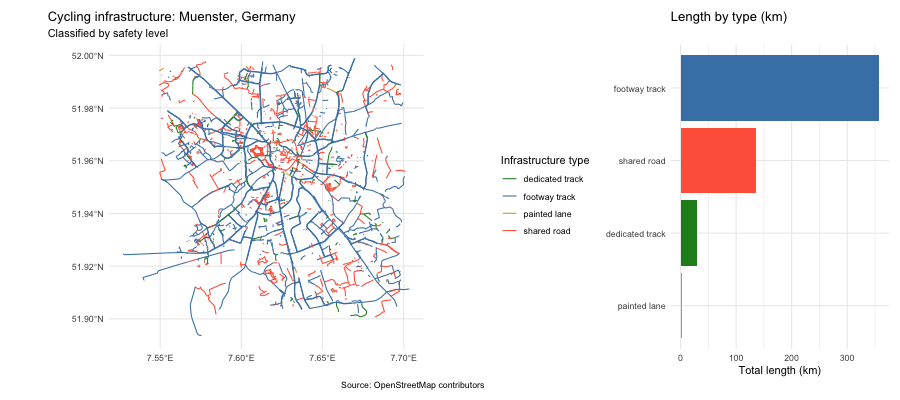
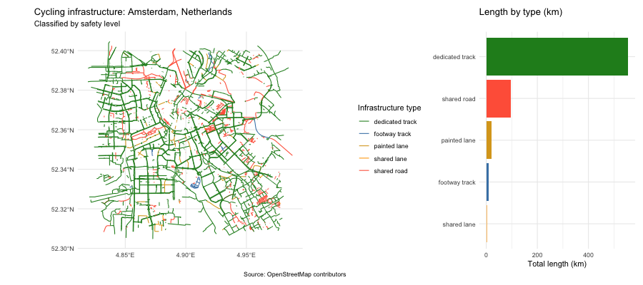
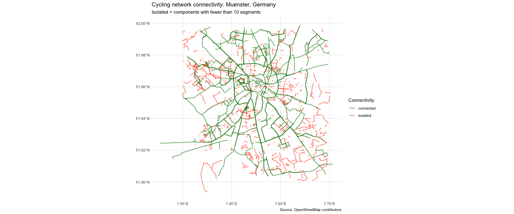
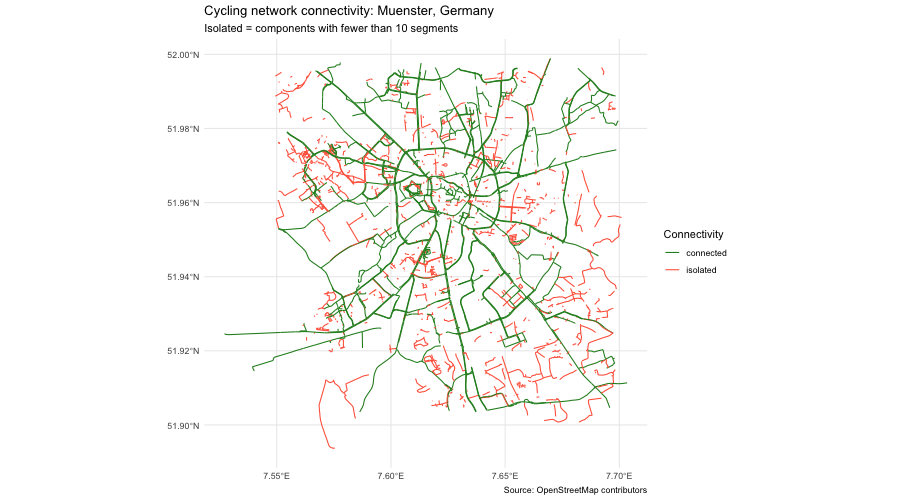

# cyclinginfra 🚲


**cyclinginfra** is an R package for downloading, classifying and visualising urban cycling infrastructure using freely available [OpenStreetMap](https://www.openstreetmap.org) data. Built as part of the *Spatial Data Science with R* course at the University of Münster 🇩🇪

---

## What it does

Given any city name, **cyclinginfra** fetches the full cycling network from OSM and classifies every road segment by safety level, from physically separated tracks all the way down to roads where bikes and cars share space with no markings.

Safety is measured by physical separation from motor traffic. A dedicated track scores highest because it is fully separated. Completeness refers to the percentage of the road network that has any form of cycling infrastructure.


| Level | Type | Description |
|-------|------|-------------|
| 🟢 1 | `dedicated track` | Fully separated from motor traffic |
| 🔵 2 | `footway track` | Shared with pedestrians, separated from cars |
| 🟡 3 | `painted lane` | Bike lane painted on road |
| 🟠 4 | `shared lane` | Shared with cars, light marking only |
| 🔴 5 | `shared road` | Bikes permitted on normal road, no dedicated space |

---

## Installation

```r
# install.packages("devtools")
devtools::install_github("al415615/cyclinginfra")
```

### Dependencies

The package uses the following packages, all installed automatically:

- [`osmdata`](https://docs.ropensci.org/osmdata/) — query OpenStreetMap
- [`sf`](https://r-spatial.github.io/sf/) — handle spatial data
- [`ggplot2`](https://ggplot2.tidyverse.org/) — visualise
- [`dplyr`](https://dplyr.tidyverse.org/) — classify segments
- [`ggspatial`](https://paleolimbot.github.io/ggspatial/) — add basemap tiles
- [`patchwork`](https://patchwork.data-imaginist.com/) — combine plots

---

## Quick start

```r
library(cyclinginfra)

# 1. Download the cycling network of any city
net <- get_cycling_network("Muenster, Germany")
print(net)
plot(net)

# 2. Classify each segment by safety level
cl <- classify_bike_infrastructure(net)
print(cl)

# 3. Full safety map + bar chart
plot_cycling_safety_map(cl)
```

---

## S3 Classes

### `cycling_network`

Stores the raw OSM cycling network for a city.

```r
net <- get_cycling_network("Muenster, Germany")

print(net)
#> cycling_network object
#>   City         : Muenster, Germany
#>   Download date: 2026-05-29
#>   Network lines: 3241 segments
#>   CRS          : EPSG:4326
```

### `cycling_classification`

Extends `cycling_network` with a per-segment safety classification and summary statistics.

```r
cl <- classify_bike_infrastructure(net)

print(cl)
#> cycling_classification object
#>   City         : Muenster, Germany
#>   Download date: 2026-05-29
#>   Segments     : 3241
#>
#> Infrastructure summary (km per type):
#>       infra_type total_length_km
#>  dedicated track          148.30
#>    footway track           89.12
#>     painted lane           34.71
#>      shared lane            9.44
#>      shared road            5.20
```

---

## Functions

| Function | Description |
|----------|-------------|
| `get_cycling_network(city)` | Download OSM cycling data for a city |
| `classify_bike_infrastructure(network)` | Classify segments by safety level |
| `plot_cycling_safety_map(classification)` | Safety map + summary bar chart |
| `compare_cities(city1, city2)` | Side by side comparison of two cities |
| `analyze_connectivity(network)` | Identify connected and isolated segments |

All five functions above are S3 generics: `classify_bike_infrastructure()` and `analyze_connectivity()` dispatch on `cycling_network` objects, while `plot_cycling_safety_map()` and `compare_cities()` dispatch on `cycling_classification` objects. Each generic also has a `.default` method that raises an informative error if called on an unsupported object type.

---

## Example output

### Münster, Germany 🇩🇪

Running `plot_cycling_safety_map()` on Münster produces a map like this, green dominates, which reflects Münster's reputation as one of Germany's most cycling friendly cities 🚲



### Amsterdam, Netherlands 🇳🇱

If we execute `plot_cycling_safety_map()` on Amsterdam, the map shows a larger proportion of green ("dedicated track") than in Münster. Make sense since Amsterdam has its reputation on being THE city FOR bikes 🚲



### Comparison 🇩🇪 vs 🇳🇱

`compare_cities()` allows us to visualize the maps for both cities using the same exact color palette, this facilitates the visual comparison between the type of instrastructure used in these cities without needing to check the summary tables 🚲



### Connectivity analysis 🇩🇪

`analyze_connectivity()` is meant to analyze which segments from the network are part of a bigger segment (green) compared to the ones that remain isolated (red). In other words, which sections are we not able to reach WITHOUT exiting the bike lane 🚲



---

## Learn more

[](https://al415615.github.io/cyclinginfra/articles/introduction.html)

Or locally after installation:

```r
vignette("introduction", package = "cyclinginfra")
```
---

## Data source

All data come from [OpenStreetMap](https://www.openstreetmap.org) contributors, available under the [Open Database Licence (ODbL)](https://opendatacommons.org/licenses/odbl/1-0/).

---

## Author

**Andrea Belen Cretu Toma**

[](https://www.linkedin.com/in/belen-cretu-toma/)
[](https://github.com/al415615)

*Final assignment · Spatial Data Science with R · University of Münster, 2026*